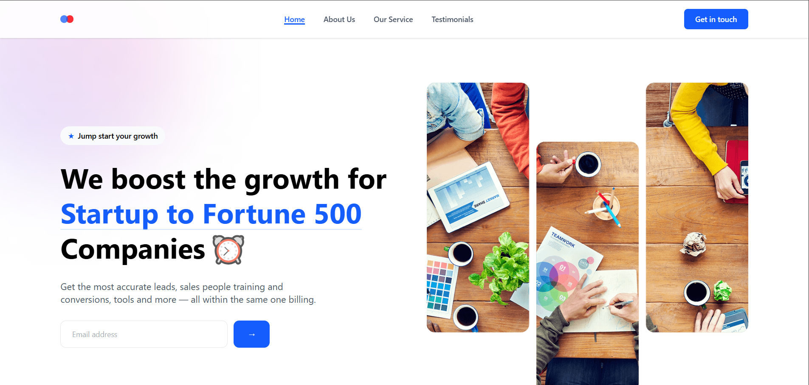

# 🚀 GrowthSync — Modern Agency Landing Page

A responsive landing page for a fictional business agency.  
Built to practice frontend skills using:

- ⚛️ React (v19)
- 💨 Tailwind CSS (v4)
- ⚡ Vite (v6)

---

## 📸 Preview



> 🔗 Live Demo: [https://itsfarouk.github.io/growthsync](https://itsfarouk.github.io/growthsync)

---

## 📦 Features

- 🧩 Component-based React structure
- 📱 Fully responsive layout
- 🎨 Styled with Tailwind utility classes
- 📅 Scheduling + services section
- ⭐ Client testimonials + pricing plans

---

## 🛠️ Getting Started

```bash
git clone https://github.com/itsfarouk/growthsync
cd growthsync
npm install
npm run dev
